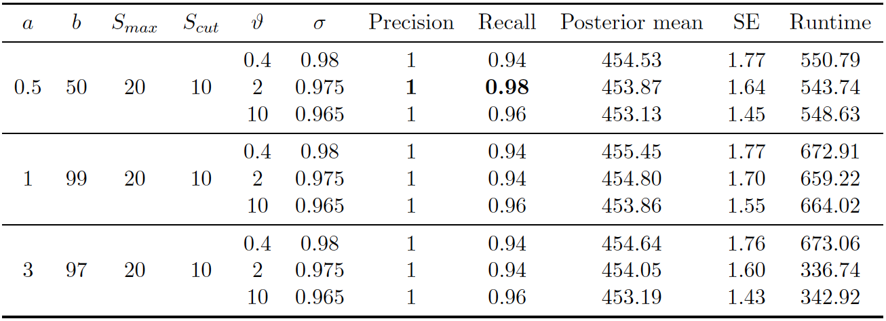
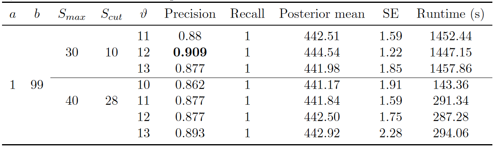
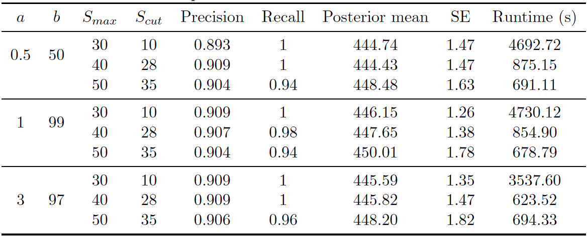

```{r plot1-def, echo=FALSE}
plot1 <- function(result) {
  par(mfrow = c(1,2))
  plot(result@history$iteration, result@history$numLinkedEntities, type = "l", xlab="Iteration", ylab="Num. linked entities")
  hist(result@history$numLinkedEntities, main="", xlab="Number of records")
  abline(v=450, col="red") # true pop
  abline(v=mean(result@history$numLinkedEntities), col="black")
  abline(v=quantile(result@history$numLinkedEntities, probs=c(0.025,0.975)), col="blue", lty=2)
  par(mfrow = c(1,1))
}
```

```{r plot2-def, echo=FALSE}
plot2 <- function(result) {
  def.par <- par(no.readonly = TRUE)
  layout(matrix(c(1,2),nrow=1), width=c(4,1)) 
  par(mar=c(5,4,4,0)) #No margin on the right side
  matplot(result@history$iteration, result@history$numDistortions, type="l", xlab="Iteration", ylab="Num. distortions")
  attrNames <- colnames(result@history$numDistortions)
  par(mar=c(5,0,4,2)) #No margin on the left side
  plot(c(0,1),type="n", axes=F, xlab="", ylab="")
  legend("center", attrNames, col=seq_along(attrNames), cex=0.8, fill=seq_along(attrNames))
  par(def.par)
}
```


# Application To Synthetic Data {#synthetic}

In this section, we first apply our proposed methodology to synthetic data sets before applying our methodology in section \@ref(elsalvador) to El Salvador. We describe the synthetic data, describe the evaluation metrics, and then provide our results on the synthetic data set. In our experiments on RLdata500, we compared our proposed methodology of the PYP and DP priors to the uniform prior of [@steorts_entity_2015]. We elaborate on the settings of each of these below.

The RLdata500 synthetic data set is available in the RecordLinkage package in CRAN. It consists of 500 records, where 10 percent of the records are duplicates. That is, 450 individuals of this data set are unique entities. Features available in this data set are first and last German name and full date of birth. In addition, there are ground truth identifiers available for all records in this data set, so that we can easily ascertain the sensitivity and robustness of our proposed methodology. 

## Parameter Settings {#parameter-setting}
We first provide all settings that are used in our experiments on RLdata500. Since we have ground truth in this particular application, we know that the true number of unique entities is 450. This helps us in choosing the hyper-parameters of the DP and the PYP distributions. As we explain below, for each prior, such as the PYP, we test several different hyper-parameter settings, and run the Gibbs sampler for each experiment. 

**PYP prior parameters.**
For example, we assume that the prior mean of the latent population is 450. Next, we choose three different prior variances of the latent population: 2840, 1610, and 584. For the PYP prior, we then solve for the parameters using (\ref{eqn:1}) and (\ref{eqn:2}) to arrive at three sets of PYP prior hyper-parameters $$(\vartheta, \sigma): (0.4, 0.98), (2, 0.975), (10, 0.965).$$ Next, we chose three sets of prior hyper-parameters for the Beta distortion prior $$(a, b): (0.5, 50), (1, 99), (3, 97).$$ These settings all satisfy the constraints on the prior, and correspond to prior mean of 0.001, 0.01, and 0.03 for the distortion probability. These settings were recommended in [@steorts_entity_2015], and thus, this motivates our choice of these parameter settings here. Finally, we choose $S_{max}$ and $S_{cut}$ in the string similarity measure of first name and last name to be $(20, 10)$ for the PYP prior setting. This means that we will treat similarity below 10 as zero. 

**DP prior parameters.**
Since DP is a special case of the PYP, we start with the hyperparameter settings described above for the PYP. We also perform a random search over the space of concentration parameter $\vartheta$, as well as the string similarity measure. 

**Uniform prior parameters.**
For the uniform prior on the linkage structure, given the sensitivity analysis completed in [@steorts_entity_2015], we utilize the best configuration for the parameters, which is $(a,b) = (1, 99)$. We refer the reader to this paper for a full review regarding the sensitivity analysis. 
We also perform a random search over the string similarity measure.

## Evaluation Metrics {#evaluation-metrics}
In order to assess our model performance, we consider the following entity resolution metrics (a) precision, (b) recall, (c) posterior mean (estimated population size), (d) posterior standard error, and (e) runtime. 

The precision and recall are defined in the following way: 
$$\text{Precision} = \text{TP} / (\text{TP} + \text{FP}) \; \text{and} \; \text{Recall} = \text{TP} / (\text{TP} + \text{FN}),$$
where TP = \# of ground truth matching pairs that are also predicted matches, FP = \# of ground truth non-matching pairs that are predicted matches, and FN = \# of ground truth matching pairs that are predicted non-matches.

## RLdata500 Results {#rldata500-results}
We now provide the experimental results of our proposed methodology using the PYP and DP priors, where we also make a comparison with the uniform prior of [@steorts_entity_2015].

**PYP prior on RLdata500.**
First, we consider the PYP prior on the linkage structure. The best parameter setting used was $(a,b)=(0.5, 50)$, $(S_{max}, S_{cut}) = (20, 10)$, $(\vartheta, \sigma) = (2, 0.975),$ where best is determined based upon the evaluation metrics defined in section \@ref(evaluation-metrics).  

(ref:syn-trace-pyp) **PYP prior on RLdata500**. Posterior diagnostic plots for our proposed method with PYP clustering prior with $(a,b)=(0.5, 50)$, $(S_{max}, S_{cut}) = (20, 10)$, and $(\vartheta, \sigma) = (2, 0.975)$. The left plot shows the trace plot of the latent ``population" size that are estimated for 30000 iterations of the Gibbs sampler. The right plot shows the posterior density of the number of distinct individuals in the sample for the RLdata500 data set under the proposed methodology, along with the posterior mean of 453.87 (black line), true value of 450 (red line) and 95\% credible interval of [451, 457] (blue dashed line).

```{r syn-trace-pyp, echo=FALSE, fig.cap='(ref:syn-trace-pyp)'}
# load data
load("~/Desktop/Thesis/thesis-sp19-zhuang-entity_resolution/index/data/rlpyp.RData")
pyp.result <- result

# plot 1 popsize trace and hist
plot1(pyp.result)
```

(ref:syn-distortion-pyp) **PYP prior on RLdata500**. Convergence diagnostic plot for the number of distortions in each attribute along the Markov Chain.

```{r syn-distortion-pyp, echo=FALSE, fig.cap='(ref:syn-distortion-pyp)'}
# plot 2 distortion trace
plot2(pyp.result)
```

(ref:rlpyp-results) **PYP prior on RLdata500.** Performance of proposed method (PYP) on RLdata500. 11,000 iterations of Gibbs sampler were executed.

```{r rlpyp-results, out.width='100%', echo=FALSE, fig.cap='(ref:rlpyp-results)'}
# insert results table from sensitivity analysis

```

Figure \@ref(fig:syn-trace-pyp) (right) illustrates the posterior density of population size under the model, with lines indicating predicted mean, true mean, and 95\% credible interval. Table \@ref(fig:rlpyp-results) presents evaluation metrics for all our experiments under the PYP prior. As one can observe, under the PYP prior, when the prior expectation is set to the true number of clusters (450), the recall and precision remain both above 0.9, regardless of how we set the degree of the prior variability. Turning to inference, the posterior mean was typically close to the truth, although typically over-estimating the true value. The posterior errors remain quite small. 

Figure \@ref(fig:syn-trace-pyp) (left) illustrates the number of linked latent entities versus the number of Gibbs iterations (or rather a trace plot). From the trace plot we do not see any apparent issues with convergence after 30000 iterations of the Gibbs sampler. As an additional diagnostic, Figure \@ref(fig:syn-distortion-pyp) illustrates the number of distortions for each attribute along the Gibbs sampler, and we also do not see any apparent sign of non-convergence. We notice that the number of distortions remain below 10\% in the categorical fields, birth year, month, and day. On the other hand, the number of distortions are higher for the string fields, which are between 20\% and 30\%. This is consistent with our prior belief that string fields are more prone to distortions than categorical fields. 

**DP prior on RLdata500.**
Second, we consider the DP prior on the linkage structure, which is a special case of the PYP where the discount parameter $\sigma=0$. The best parameter setting used was $(a, b) = (1, 99)$, $(S_{max}, S_{cut}) = (30, 10)$, and $\alpha = 12$.

(ref:syn-trace-dp) **DP prior on RLdata500**. Posterior diagnostic plots for our proposed method with DP clustering prior with $(a,b)=(1, 99)$, $(S_{max}, S_{cut}) = (30, 10)$, and $\alpha = 12$. The left plot shows the trace plot of the latent ``population" size that are estimated for 100000 Gibbs samples for the RLdata500 data set. The right plot shows the posterior density of the number of distinct individuals in the sample for the RLdata500 data set under the proposed methodology, along with the posterior mean of 442.50(black line), true value of 450 (red line) and 95\% credible interval of [438, 446] (blue dashed line).

```{r syn-trace-dp, echo=FALSE, fig.cap='(ref:syn-trace-dp)'}
# load data
load("~/Desktop/Thesis/thesis-sp19-zhuang-entity_resolution/index/data/rldp.RData")
dp.result <- result

# plot 1 popsize trace and hist
plot1(dp.result)
```

(ref:syn-distortion-dp) **DP prior on RLdata500**. Convergence diagnostic plot for the number of distortions in each attribute along the Markov Chain.

```{r syn-distortion-dp, echo=FALSE, fig.cap='(ref:syn-distortion-dp)'}
# plot 2 distortion trace
plot2(dp.result)
```

(ref:rldp-results) **DP prior on RLdata500.** Performance of proposed method (DP) on RLdata500. 100,000 iterations of Gibbs sampler were executed.

```{r rldp-results, out.width='100%', echo=FALSE, fig.cap='(ref:rldp-results)'}
# insert results table from sensitivity analysis

```

Figure \@ref(fig:syn-trace-dp) shows the posterior density of the population size under the model, with lines indicating predicted mean, true mean, and 95\% credible interval. Figure \@ref(fig:rldp-results) shows the evaluation metrics for all the experiments that we conducted under the DP prior. The model with DP prior was able to achieve perfect recall in all experiments, while the highest precision achieved was 0.909. The estimated posterior mean of the observed population was father from the truth compared to the PYP model. In addition, the DP prior consistently underestimates the observed population size, whereas the PYP overestimates the observed population size. In both cases, the posterior standard error are low. 

Turning to convergence diagnostics, we did not see any signs of a lack of convergence under the DP prior after 100000 iterations of the Gibbs sampler. Note that the DP prior took longer to converge than the PYP prior. Figure \@ref(fig:syn-distortion-dp) illustrates the number of distortions for each attribute versus the number of Gibbs iterations. We notice that the number of distortions remain below 10\% in the categorical fields, birth year, month, and day. The number of distortions are still higher for the string fields, but under the DP prior, the numbers were reduced to between 15\% and 22\%, which is an improvement compared to under the PYP prior. 

Turning to computational speed, the runtimes varied depending on the maximum similarity allowed in the Levenshtein similarity function and the threshold for truncation. Higher thresholds, which correspond to the maximum similarity can result in memory storage, which results in faster sampling, and thus, a faster runtime. In addition, if the maximum similarity is also set to a low value, the the model allows for more distortion in the sampling process, which will lead to longer run times. 

**Uniform prior on RLdata500**.
Third, we consider the uniform prior on the linkage structure, as in [@steorts_entity_2015]. The best parameter setting used was $(a,b)=(1, 99)$ and $(S_{max}, S_{cut}) = (30, 10)$. 

(ref:syn-trace-uni) **Uniform prior on RLdata500**. Posterior diagnostic plots for our proposed method with uniform clustering prior with $(a,b)=(1, 99)$ and $(S_{max}, S_{cut}) = (30, 10)$. The left plot shows the trace plot of the latent ``population" size that are estimated for 90000 Gibbs samples for the RLdata500 data set. The right plot shows the posterior density of the number of distinct individuals in the sample for the RLdata500 data set under the proposed methodology, along with the posterior mean of 446.15 (black line), true value of 450 (red line) and 95\% credible interval of [444, 448] (blue dashed line).

```{r syn-trace-uni, echo=FALSE, fig.cap='(ref:syn-trace-uni)'}
# load data
load("~/Desktop/Thesis/thesis-sp19-zhuang-entity_resolution/index/data/rluni.RData")
uni.result <- result

# plot 1 popsize trace and hist
plot1(uni.result)
```

(ref:syn-distortion-uni) **Uniform prior on RLdata500**. Convergence diagnostic plot for the number of distortions in each attribute along the Markov Chain.

```{r syn-distortion-uni, echo=FALSE, fig.cap='(ref:syn-distortion-uni)'}
# plot 2 distortion trace
plot2(uni.result)
```

(ref:rluni-results) **Uniform prior on RLdata500.** Performance of proposed method (Uniform) on RLdata500. 90,000 iterations of Gibbs sampler were executed.

```{r rluni-results, out.width='100%', echo=FALSE, fig.cap='(ref:rluni-results)'}
# insert results table from sensitivity analysis

```


Figure \@ref(fig:syn-trace-uni) shows the posterior density of the population size under the model, with lines indicating predicted mean, true mean, and 95\% credible interval. Figure \@ref(fig:rluni-results) shows the evaluation metrics for all the experiments that we conducted under the uniform prior. 

Turning to convergence diagnostics, we did not see any signs of a lack of convergence under the Uniform prior after 90,000 iterations of the Gibbs sampler. Notice that the Uniform prior also converged much slower than the PYP prior in the application to this data set.
Figure \@ref(fig:syn-distortion-uni) shows the number of distortions for each attribute versus the Gibbs sampler. We notice that the number of distortions remain below 10\% in the categorical fields, birth year, month, and day. The number of distortions are still higher for the string fields, but under the uniform prior, the numbers were even reduced from that of the DP prior.  The model with the uniform prior was able to achieve high precision and recall in all experiments. The highest precision and recall achieved was 0.909 and 1 under the best configuration. 
The posterior mean population was relatively close to the truth, and the model consistently underestimated the true value. Posterior standard errors remained low. Runtime again varied depending on the maximum similarity allowed in the Levenshtein similarity function and the threshold for truncation.


## Discussion of Application on RLdata500

In this section, we briefly summarize our results on the RLdata500 data set. Under the best settings described in Section \@ref(rldata500-results), the PYP prior overall performs the best in terms of the precision (1), recall (0.98) with a 95 percent credible interval of [451, 457]. There is a tendency for the PYP to slightly overestimate the true value of number of unique records, whereas the DP and Uniform prior consistently underestimate the true value. All methods tend to have a balance between the recall and precision, which is a desired property in the field of entity resolution. In terms of computational complexity, the uniform prior is the slowest to mix, which is not unexpected given the fact that we are starting from a very unlikely configuration of the linkage structure. This results in the Gibbs sampler to need to be run for much longer compared to the PYP or DP prior. For example, if we have some idea about the true number of clusters of the existing population apriori, we are able to provide guidance regarding the two unknown parameters of the PYP prior. We are able to provide similar guidance for the DP prior. This in turn allows for faster mixing and a faster computational time of the Gibbs sampler. 


