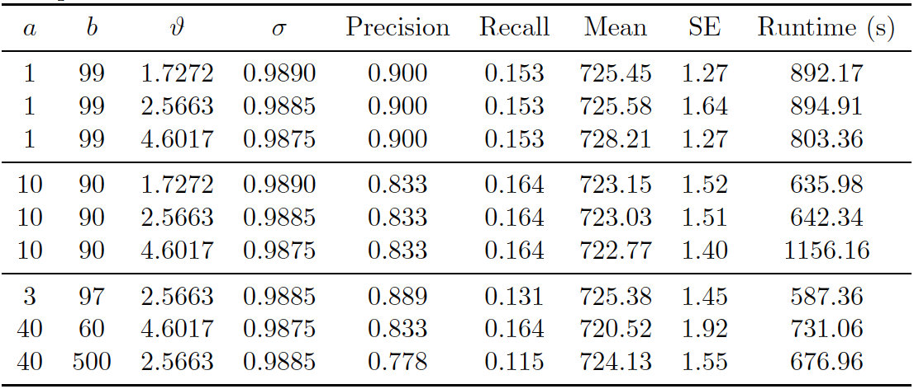
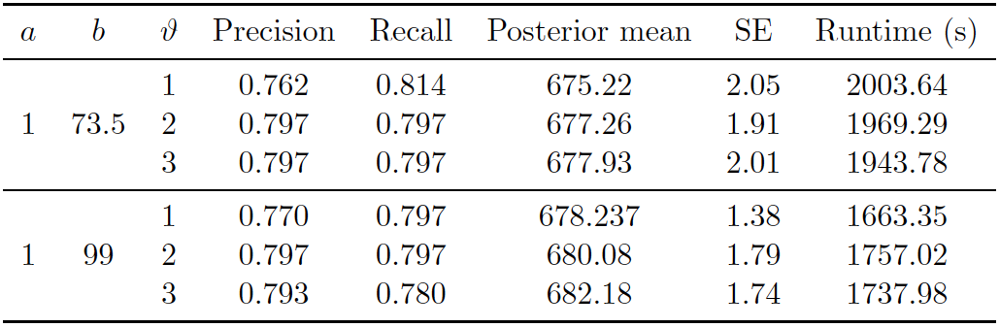
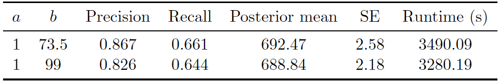

```{r plot1sv-def, echo=FALSE}
plot1.sv <- function(result) {
  par(mfrow = c(1,2))
  plot(result@history$iteration, result@history$numLinkedEntities, type = "l", xlab="Iteration", ylab="Num. linked entities")
  hist(result@history$numLinkedEntities, main="", xlab="Number of records")
  abline(v=680, col="red") # true pop
  abline(v=mean(result@history$numLinkedEntities), col="black")
  abline(v=quantile(result@history$numLinkedEntities, probs=c(0.025,0.975)), col="blue", lty=2)
  par(mfrow = c(1,1))
}
```

# Application to El Salvodoran Conflict Data {#elsalvador}

In this section, we consider a case study to entity resolution by applying our proposed 
methods to the UNTC data set from El Salvadorian Civil War, introduced in Section 
\@ref(UNTC). The evaluation metrics in this section are the same as in Section \@ref(evaluation-metrics). 

## Parameter Settings {#parameter-settings-sv}
We first provide all settings that are used in our experiments on the UNTC data set. 
There is no ground truth information available for this data set except for two departments, 
namely 1 and 7. Hand matching was done by [@Sadinle14] for both of these departments, 
and we refer to the details of this paper regarding how the hand matching was performed. 
Given that we do not know the true cluster size of departments 1 or 7, we will assume 
that the true cluster sizes are close to the posterior mean of both departments 1 and 7 
reported in [@Sadinle14], which is 680 unique clusters in total. We investigate intensively 
the hyperparameters of prior distortion, the concentration and discount parameters of the linkage structure, as well as the attribute similarity measures using the prior knowledge and random search.
We also perform random search in a "coordinate" descent fashion along each of the attributes 
due to the large space of similarity measures of each attribute.

## UNTC Results {#untc-results}
In this section, we provide the experimental results of our proposed methodology
using the PYP and DP priors and the Uniform prior of [@steorts_entity_2015] on 
the UNTC data set. 

**PYP Prior on UNTC**.
First, we consider the PYP prior on the linkage structure. The best parameter setting 
used was $(a,b)=(1, 99)$, $(\vartheta, \sigma) = (4.6017, 0.9875)$ and the similarity 
configuration for each attribute is listed in Table \@ref(tab:sv-pyp-best). 

--------------------------------------
  Field      $S_{max}$      $S_{cut}$
---------   -----------    -----------
firstname        40             28

lastname         40             28

 dept            20             10

 muni            20             10

 day             10             5

 month           10             5

 year            20             10
---------   -----------    -----------
Table: (\#tab:sv-pyp-best) **PYP Prior on UNTC**. Best configuration of attribute similarity measures for UNTC data set. Recall that similarities below $S_{cut}$ are effectively treated as zero (truncation) in order to speed up the sampling. 

(ref:sv-trace-pyp) **PYP Prior on UNTC**. Posterior diagnostic plots for our proposed method with PYP clustering prior with $(a,b)=(1, 99)$, $(\vartheta, \sigma) = (4.6017, 0.9875)$, and similarity configuration for each attribute specified in Table \@ref(tab:sv-pyp-best). The left plot shows the trace plot of the latent "population" size that are estimated for 20000 Gibbs samples for the UNTC data set. The right plot shows the posterior density of the number of distinct individuals in the sample for the UNTC data set under the proposed methodology, along with the posterior mean of 725.02 (black line), "true" value of 680 (red line) and 95\% credible interval of [723, 727] (blue dashed line).

```{r sv-trace-pyp, echo=FALSE, fig.cap='(ref:sv-trace-pyp)'}
# load data
load("~/Desktop/Thesis/thesis-sp19-zhuang-entity_resolution/index/data/svpyp.RData")
svpyp.result <- result

# plot 1 popsize trace and hist
plot1.sv(svpyp.result)
```

(ref:sv-distortion-pyp) **PYP Prior on UNTC**. Convergence diagnostic plot for the number of distortions in each attribute versus the number of Gibbs iterations.

```{r sv-distortion-pyp, echo=FALSE, fig.cap='(ref:sv-distortion-pyp)'}
# plot 2 distortion trace
plot2(svpyp.result)
```

(ref:svpyp-results) **PYP Prior on UNTC**. Performance of proposed method (PYP) on UNTC. 20000 iterations of Gibbs sampler were executed.

```{r svpyp-results, out.width='100%', echo=FALSE, fig.cap='(ref:svpyp-results)'}
# insert results table from sensitivity analysis

```

Figure \@ref(fig:sv-trace-pyp) shows the posterior density of population size under the model, with lines indicating 
predicted mean, true mean, and 95\% credible interval. In addition, we provide 
evaluation metrics for all the experiments we conducted in Figure \@ref(fig:svpyp-results). 
The model with PYP prior was able to achieve very high precision in all experiments, 
however the highest recall achieved was around 0.16. The posterior mean of the 
observed population was quite far from the truth. Under the PYP, we see that the 
model consistently overestimates the true value. Posterior standard error was low.

From the trace plot we assess the convergence of our Gibbs sampler under the PYP prior. 
We do not see any apparent sign for non-convergence after 20000 iterations. 
Figure \@ref(fig:sv-distortion-pyp) shows the number of distortions for each attribute along 
the Markov chain, and we also do not see any apparent sign of non-convergence. 
We notice that the number of distortions remain below 5\% in the department field, 
is about 15-20\% for firstname, lastname and month fields, and is about 30-40\% for
the municipality, day and year fields. This is very different from our findings on the 
RLdata500 data set, where in general we observed low distortion in the 
categorical fields and higher distortion in the string fields. Real world data sets, 
such as the UNTC data set, are often much more noisy, with higher degree of 
distortion on average.

Turning to computational speed, we found that our model with PYP prior was still able 
to converge in a relatively short amount of time, even with increased data size and 
more complex attributes. Runtime also varied with the changing concentration and 
discount hyper-parameters, but the difference is not too significant.

**DP Prior on UNTC**.
Secondly, we consider the DP prior on the linkage structure, which is a special case 
of the PYP when the discount parameter $\sigma=0$. The best parameter setting 
used was $(a, b) = (1, 99)$, $\vartheta = 2$ and the similarity configuration for each 
attribute listed in Table \@ref(tab:sv-dp-best). 

--------------------------------------
  Field      $S_{max}$      $S_{cut}$
---------   -----------    -----------
firstname        40             28

lastname         40             28

 dept            20             10

 muni            20             10

 day             10             5

 month           10             5

 year            20             10
---------   -----------    -----------
Table: (\#tab:sv-dp-best) **DP Prior on UNTC**. Best configuration of attribute similarity measures for UNTC data set. Recall that similarities below $S_{cut}$ are effectively treated as zero (truncation) in order to speed up the sampling.

(ref:sv-trace-dp) **DP Prior on UNTC**. Posterior diagnostic plots for our proposed method with DP clustering prior with $(a,b)=(1, 99)$, $\vartheta  = 2$, and similarity configuration for each attribute specified in Table \@ref(tab:sv-dp-best). The left plot shows the trace plot of the latent "population" size that are estimated for 50000 Gibbs samples for the UNTC data set. The right plot shows the posterior density of the number of distinct individuals in the sample for the UNTC data set under the proposed methodology, along with the posterior mean of 680.66 (black line), "true" value of 680 (red line) and 95\% credible interval of [677, 684] (blue dashed line).

```{r sv-trace-dp, echo=FALSE, fig.cap='(ref:sv-trace-dp)'}
# load data
load("~/Desktop/Thesis/thesis-sp19-zhuang-entity_resolution/index/data/svdp.RData")
svdp.result <- result

# plot 1 popsize trace and hist
plot1.sv(svdp.result)
```

(ref:sv-distortion-dp) **DP Prior on UNTC**. Convergence diagnostic plot for the number of distortions in each attribute versus the number of Gibbs iterations.

```{r sv-distortion-dp, echo=FALSE, fig.cap='(ref:sv-distortion-dp)'}
# plot 2 distortion trace
plot2(svdp.result)
```

(ref:svdp-results) **DP Prior on UNTC**. Performance of proposed method (DP) on UNTC. 50000 iterations of Gibbs sampler were executed.

```{r svdp-results, out.width='100%', echo=FALSE, fig.cap='(ref:svdp-results)'}
# insert results table from sensitivity analysis

```

As in the PYP experiment, Figure \@ref(fig:sv-trace-dp) shows the posterior density of population size under the model, with lines indicating 
predicted mean, true mean, and 95\% credible interval. Figure \@ref(fig:svdp-results) shows 
the evaluation metrics for all the experiments that we conducted under the DP prior. 
The model with DP prior was able to achieve precision and recall around 0.8. 
The posterior mean of the observed population was very close to the "truth" of 680 
we calculated [@Sadinle14]. Posterior standard errors remain low. 

From the trace plot we assess the convergence of our Gibbs sampler 
under the DP prior.  We do not see any apparent sign for non-convergence after 
50,000 iterations. Figure \@ref(fig:sv-distortion-dp) shows the number of 
distortions for each attribute along the Markov chain, and we also do not see any 
apparent sign of non-convergence. We notice that the number of distortions remain 
below 5\% in the department field, is about 15-20\% for firstname, lastname and month 
fields, and is about 44-50\% for the municipality, day and year fields.

Turning to computational speed, the runtimes varied depending on the value of
$\vartheta$, but the difference was not too significant.

**Uniform Prior on UNTC**.
Lastly, we consider the uniform prior on the linkage structure, as in [@steorts_entity_2015]. 
The best parameter setting used was $(a,b)=(1, 73.5)$ and the similarity configuration 
for each attribute listed in Table \@ref(tab:sv-uni-best). 

--------------------------------------
  Field      $S_{max}$      $S_{cut}$
---------   -----------    -----------
firstname        40             28

lastname         40             28

 dept            20             10

 muni            20             10

 day             10             5

 month           10             5

 year            20             10
---------   -----------    -----------
Table: (\#tab:sv-uni-best) **Uniform Prior on UNTC**. Best configuration of attribute similarity measures for UNTC data set. Recall that similarities below $S_{cut}$ are effectively treated as zero (truncation) in order to speed up the sampling.

(ref:sv-trace-uni) **Uniform Prior on UNTC**. Posterior diagnostic plots for our proposed method with uniform clustering prior with $(a,b)=(1, 73.5)$ and similarity configuration for each attribute specified in Table \@ref(tab:sv-uni-best). The left plot shows the trace plot of the latent "population" size that are estimated for 130000 Gibbs samples for the UNTC data set. The right plot shows the posterior density of the number of distinct individuals in the sample for the UNTC data set under the proposed methodology, along with the posterior mean of 692.47 (black line), "true" value of 680 (red line) and 95\% credible interval of [688, 698] (blue dashed line).

```{r sv-trace-uni, echo=FALSE, fig.cap='(ref:sv-trace-uni)'}
# load data
load("~/Desktop/Thesis/thesis-sp19-zhuang-entity_resolution/index/data/svuni.RData")
svuni.result <- result

# plot 1 popsize trace and hist
plot1.sv(svuni.result)
```

(ref:sv-distortion-uni) **Uniform Prior on UNTC**. Convergence diagnostic plot for the number of distortions in each attribute versus the number of Gibbs iterations.

```{r sv-distortion-uni, echo=FALSE, fig.cap='(ref:sv-distortion-uni)'}
# plot 2 distortion trace
plot2(svuni.result)
```

(ref:svuni-results) **Uniform Prior on UNTC**. Performance of proposed method (Uniform) on UNTC. 130000 iterations of Gibbs sampler were executed.

```{r svuni-results, out.width='100%', echo=FALSE, fig.cap='(ref:svuni-results)'}
# insert results table from sensitivity analysis

```

Figure \@ref(fig:sv-trace-uni) shows 
the posterior density of the population size under the model, with lines indicating 
predicted mean, true mean, and 95\% credible interval. Figure \@ref(fig:svuni-results) shows
the evaluation metrics for all the experiments that we conducted under the uniform prior. 
The best precision and recall resulted from model with uniform prior was 0.867 and 0.661. 
The posterior mean population was relatively close to the truth, and the model consistently overestimated the value. Posterior standard error remained low. Runtime again varied 
depending on the maximum similarity allowed in the similarity function and
the threshold for truncation.

From the trace plots we assess the convergence of our Gibbs sampler under the uniform prior. 
We do not see any apparent sign of non-convergence after 130000 iterations. 
Figure \@ref(fig:sv-distortion-uni) shows the number of distortions for each attribute along the 
Markov chain, and we also do not see any apparent sign of non-convergence. 
We notice that the number of distortions remain below 5\% in the department field, 
is about 15-20\% for firstname, lastname and month fields, and is about 44-50\% 
for the municipality, day and year fields.

As shown in Figure \@ref(fig:svuni-results), computational speed varied depending on the maximum similarity allowed in the similarity function and the threshold for truncation. 


## Discussion of Application on UNTC data {#sv-discussion}
In this section, we briefly summarize our results on the UNTC data set. Under the best setting given in Section \@ref(untc-results), the DP prior overall performs the best in terms of precision (0.8), recall (0.8), with a 95 percent credible interval of [677,684]. The DP prior was able to generate estimates very tightly around the true cluster size, while the PYP and Uniform prior consistently overestimate the true value. All methods tend to have a balance between the precision and recall, which is desired in the field of entity resolution. In terms of computational complexity, the uniform prior is again the slowest to mix, as we have observed in RLdata500 experiments. Because the DP and PYP prior are more subjective and flexible than the Uniform prior, we are able to provide prior guidance in the selection of hyper-parameters, if we have some idea about the true cluster size apriori. This allows for faster mixing and faster computational time of the Gibbs sampler. 

In applying our proposed method with Bayesian nonparametric priors to the UNTC data set, we make note again that the potential users of our methodology are various human rights groups who need accurate estimates and evaluations of the number of documented identifiable deaths. 
It is always important, therefore, to inform them about the choice of priors and the uncertainty of the Bayesian framework by nature. In terms of estimated number of deaths and the standard error, the three priors we considered were able to produce estimates in the reasonable range, with small variation. Depending on these groups' expert knowledge of the data set, in the actual application we could choose one prior over another, after experimenting with tuning parameters and doing a thorough sensitivity analysis. In terms of applying entity resolution to a new real world conflict data set, we believe that our Bayesian model needs to be adjusted in a few ways. First, depending on the language of the country, it is likely that different similarity measures than the one we use here needs to be proposed. Secondly, different priors may have to be incorporated. And finally, the parameters of priors will have to be tuned specifically for the data set at hand.

